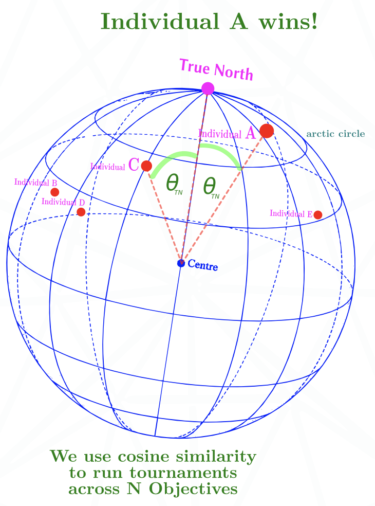

# HFF — Hyperspherical Fitness Functions

A Rust library for many-objective optimisation, usable from Python (via PyO3,
the Rust↔Python binding layer) and from C (via a C ABI — the Application Binary
Interface, i.e. the C-callable functions exported from the compiled shared
library). HFF projects an objective vector onto a unit hypersphere and uses
**angular distance to a reference pole** as a scalar fitness measure.

The dimensionality of Pareto-dominance front degrades as the number of
objectives grows — at high dimensionality nearly every solution is
non-dominated and selection pressure collapses. HFF replaces the dominance
relation with a single scalar that scales naturally with objective count, and
remains useful at low dimensions (2–3 objectives) as a principled alternative
to weighted sums.

This repository contains the library, three demonstration notebooks (symbolic
regression, binary classification, and equation rediscovery), and the
as-submitted GECCO 2026 poster.

<p align="center">
  
</p>

<p align="center"><em>HF1 TrueNorth ranks candidates by their angular distance θ<sub>TN</sub> to the
reference pole — a single cosine-similarity score that runs tournaments across N objectives.</em></p>

---

## Repository contents

```
hff/
├── src/                       Rust core (HF1 Balanced/TrueNorth, HIGD, optional GPU)
├── python/hff/                PyO3 module + Python convenience wrappers
├── include/hff.h              C header for the optional c-api feature
├── notebooks/
│   ├── hff_geppy_helpers.py   shared helpers (primitives, LSM, rerankers, HIGD)
│   ├── hff_sr_engine.py       reusable symbolic-regression engine
│   ├── v1.0.4_Multidemic_SymbolicLinearRegression.ipynb    UCI PowerPlant
│   ├── v1.0.4_Multidemic_SymbolicLogisticReg.ipynb         UCI Heart Disease
│   ├── v1.0.4_Multidemic_SymbolicEquationRecovery.ipynb    equation rediscovery
│   └── data/                  UCI PowerPlant CSV + dictionary
├── srbench_submission/        SRBench (AI-Feynman) contest submission package
├── docs/                      research notes and figures
├── papers/
│   ├── GECCO_..._Poster_SUBMITTED.pdf
│   └── hff-gecco2026-poster_Submitted.tex
├── CLAUDE.md                  notes for AI-assisted contributors
└── README.md                  this file
```

---

## Installation

HFF is a Rust extension built with [maturin](https://github.com/PyO3/maturin);
install it from source into your active environment:

```bash
pip install maturin
maturin develop --release      # builds the Rust core and installs the hff module
```

Or as an editable install:

```bash
pip install -e .
```

Optional GPU acceleration (experimental) is gated behind the `gpu` Cargo
feature — see [GPU acceleration](#gpu-acceleration) below.

### Requirements

- Python ≥ 3.9
- Rust toolchain (for building from source)
- `geppy`, `deap`, `multiprocess`, `scikit-learn`, `pandas`, `matplotlib`,
  `seaborn`, `graphviz`, `sympy` — for running the demonstration notebooks
  (not required to use the library itself)

---

## Quick start

```python
import numpy as np
import hff

# Random 100-individual, 50-objective problem
objectives = np.random.random((100, 50))

# HF1 Balanced — equal trade-off reference pole (1/√m, ..., 1/√m)
fitness_balanced = hff.calculate_fitness_hf1(objectives)

# HF1 TrueNorth — direct minimisation via augmented space (0, ..., 0, 1)
fitness_truenorth = hff.calculate_fitness_hf1_enhanced(
    objectives, normalize=True, north_pole_method="truenorth"
)

# HIGD — CDF-corrected angular IGD (set-level quality metric)
higd_score = hff.calculate_higd(
    objectives.tolist(),
    n_reference_points=10000,
    dimensions=50,
    seed=42,
    positive_orthant=True,
)
```

### Choosing `normalize`

| Input style | Setting | Reason |
|-|-|-|
| Unbounded objectives (e.g. MSE, raw cost) | `normalize=True` (default) | HFF rescales each column to [0, 1] before projection. |
| Already-bounded objectives in [0, 1] (e.g. AUC, F1, accuracy) | `normalize=False` | Otherwise the column-best individual is mapped to all-ones and collapses onto the reference pole. |

---

## API

| Function | Purpose |
|---|---|
| `calculate_fitness_hf1(F)` | HF1 Balanced — angular distance to the diagonal pole `(1/√m, …, 1/√m)`. |
| `calculate_fitness_hf1_enhanced(F, normalize=, north_pole_method=)` | HF1 with method selection: `"balanced"` or `"truenorth"`, plus an optional `normalize` flag. |
| `calculate_fitness_hf1_with_ranges(F, decrowding=, north_pole_method=, normalize=)` | HF1 that also returns the per-column min/max ranges it used, so the same normalisation can be reapplied later (e.g. to a validation set). |
| `calculate_fitness_hf1_fixed(F, col_min, col_max, decrowding=, north_pole_method=)` | HF1 with caller-supplied column ranges instead of recomputing them — score new points on a fixed, previously-seen scale. |
| `calculate_higd(solutions, n_reference_points, dimensions, seed, positive_orthant)` | Set-level quality indicator. CDF-corrected angular IGD that is dimensionally robust. |
| `calculate_angular_igd(solutions, n_reference_points, dimensions, seed, positive_orthant)` | Raw angular IGD (no CDF correction). |

The same surface is also exposed via a C ABI when built with
`--features c-api`; see `include/hff.h`.

---

## GPU acceleration

An experimental GPU backend computes HF1 TrueNorth fitness for large batches on
the GPU via [`wgpu`](https://github.com/gfx-rs/wgpu) (Vulkan / Metal / DX12).
It is off by default and gated behind the `gpu` Cargo feature:

```bash
maturin develop --release --features gpu
```

The CPU path (Rayon-parallel) remains the default and is numerically
authoritative; the GPU kernel is validated against it in `src/gpu.rs`'s unit
tests. Treat this backend as experimental.

---

## Demonstration notebooks

Three notebooks in `notebooks/`, sharing one architecture:

> Evolve a **symbolic equation** with geppy GEP-RNC. Wrap it in a **linear
> regression** that fits constants `a, b` by least squares on every
> individual (so evolution searches *form*, not numerical constants).
> Compute the model's metrics on **train AND validation**, project the
> resulting multi-objective vector through the **HFF** Rust library to a
> single scalar fitness. Evolve under a multidemic island model. After
> evolution, simplify with sympy, snap floating-point constants to known
> physical / mathematical constants, then rewrite into the canonical
> "Feynman shape" Feynman himself would write.

### `v1.0.4_Multidemic_SymbolicLinearRegression.ipynb`

**Symbolic regression on continuous targets.** Default dataset: UCI Combined
Cycle Power Plant (`AT, V, AP, RH → PE`). The notebook evolves an equation
that predicts power plant output from environmental conditions, with the
validation-in-fitness mechanism preventing overfit. Headline: holdout R² ≈
0.93 with a 4-line evolved equation, no parsimony constraint, train/holdout
MSE gap under 1%.

Use this template for any messy real-world regression task — power
forecasting, sensor calibration, dose-response, financial pricing. The
Feynman-shape rewriter cleans the discovered form into the most readable
canonical equation it can.

### `v1.0.4_Multidemic_SymbolicLogisticReg.ipynb`

**Symbolic binary classification.** Same architecture, with a sigmoid wrapper
around the linear scaler to produce probabilities and a J-statistic-tuned
decision threshold. Default dataset: UCI Heart Disease (Cleveland), 297
patients. Headline: holdout AUC ≈ 0.91, F1 ≈ 0.86, generalisation gap
(train AUC − holdout AUC) ≈ −0.01 — the holdout actually beats train,
which is what zero overfit looks like on a small noisy dataset.

Use this template for explainable binary classification — fraud detection,
clinical risk scoring, churn, anomaly detection.

### `v1.0.4_Multidemic_SymbolicEquationRecovery.ipynb`

**Equation rediscovery from synthetic data.** Given a known equation
generates a dataset, can evolution recover the equation? The notebook ships
with a registry of six demonstration problems (circle area, Newton's
gravitation, Coulomb's law, simple pendulum, Kepler's third law, ideal gas)
plus on-demand cached data generation, all 120 equations from the AI-Feynman
Symbolic Regression Database, and BYO-equation support. The fitness vector
adds an **extrapolation** objective — train on one range of inputs, score
on a region the model never saw — so rediscovery means "found the law", not
"fit the curve".

After evolution, the snap library maps numeric constants to known physical
/ mathematical constants (`π`, `e`, `G`, `M_sun`, `R`, `k_e`, `g`, …) and
the **Feynman-shape rewriter** rewrites compact GEP forms into the canonical
shape — e.g. `5.45e-10·a·√a` → `√((4π²/GM)·a³)`. The structural-equivalence
check then proves the discovered equation equals the truth.

Use this template for symbolic regression in *science* — discovering laws
from instruments, mining clean expressions from simulated systems, A/B-ing
against known-truth benchmarks. Also the right notebook for paper-level
reproducibility comparisons.

### Shared mechanism

All three notebooks read configuration from a single 🔴 CONFIGURE HERE cell,
honour Restart-Kernel-Run-All for reproducible defaults, and expose a
re-runnable evolution cell so you can interactively extend a search by
another *N* generations. They share `hff_geppy_helpers.py` (snap library,
Feynman rewriter, HOF rerankers, set-level HIGD diagnostic).

To run them:

```bash
maturin develop --release
cd notebooks
jupyter notebook v1.0.4_Multidemic_SymbolicLinearRegression.ipynb
```

---

## Citing this work

Please cite the GECCO 2026 poster when using HFF in published research:

```bibtex
@inproceedings{morgan2026hff,
  author    = {Andrew James Morgan},
  title     = {Hyperspherical Fitness Functions for Many-Objective Optimization},
  booktitle = {Proceedings of the Genetic and Evolutionary Computation
               Conference Companion (GECCO Companion '26)},
  series    = {GECCO Companion '26},
  year      = {2026},
  month     = jul,
  location  = {San Jose, Costa Rica},
  publisher = {ACM},
  address   = {New York, NY, USA},
  isbn      = {979-8-4007-2488-6/2026/07},
  doi       = {} % add when assigned
}
```

The PDF and LaTeX source of the submitted poster are in
[`papers/`](papers/).

### Citing the code repository specifically

If you reference the library implementation (Rust core, Python wrappers, C
ABI, or the demonstration notebooks) rather than the underlying method, also
cite the repository:

```bibtex
@software{morgan2026hff_repo,
  author  = {Andrew James Morgan},
  title   = {{HFF}: Hyperspherical Fitness Functions
             (Rust + Python + C library, demonstration notebooks)},
  year    = {2026},
  url     = {https://github.com/Gamakon/HFF},
  version = {0.1.0}
}
```

### Citing the demonstration notebooks

If your work builds on the symbolic regression / classification templates in
`notebooks/`, please attribute both the method and the templates:

```bibtex
@misc{morgan2026hff_notebooks,
  author = {Andrew James Morgan},
  title  = {Symbolic Regression and Classification with Hyperspherical
            Fitness Functions ({HFF}): geppy demonstration notebooks},
  year   = {2026},
  url    = {https://github.com/Gamakon/HFF/tree/main/notebooks},
  note   = {v1.0.4: Multidemic GEP-RNC with HF1 TrueNorth fitness and
            train/validation/holdout splits.}
}
```

### Datasets used in the demonstration notebooks

The notebooks use publicly available UCI datasets. If you use the notebooks
in published work, also cite the underlying datasets:

```bibtex
@misc{uci_powerplant,
  author       = {Tüfekci, Pınar and Kaya, Heysem},
  title        = {Combined Cycle Power Plant Data Set},
  howpublished = {UCI Machine Learning Repository},
  year         = {2014},
  url          = {https://archive.ics.uci.edu/ml/datasets/Combined+Cycle+Power+Plant}
}

@misc{uci_heart_cleveland,
  author       = {Janosi, Andras and Steinbrunn, William and
                  Pfisterer, Matthias and Detrano, Robert},
  title        = {Heart Disease Data Set (Cleveland)},
  howpublished = {UCI Machine Learning Repository},
  year         = {1988},
  url          = {https://archive.ics.uci.edu/ml/datasets/Heart+Disease}
}
```

### Dependencies worth acknowledging

The notebooks rely heavily on:

- [`geppy`](https://github.com/ShuhuaGao/geppy) — Gene Expression Programming
  on top of DEAP.
- [`DEAP`](https://github.com/DEAP/deap) — Distributed Evolutionary Algorithms
  in Python.
- [`PyO3`](https://github.com/PyO3/pyo3) and
  [`maturin`](https://github.com/PyO3/maturin) — Rust ↔ Python bridge and
  build tooling.

Their respective citations are listed in the linked repositories.

---

## License

MIT.
