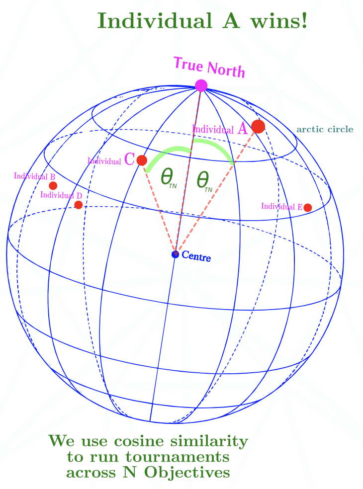

# HFF — Hyperspherical Fitness Functions

A Rust library for many-objective optimisation, usable from Python (via PyO3,
the Rust↔Python binding layer) and from C (via a C ABI — the Application Binary
Interface, i.e. the C-callable functions exported from the compiled shared
library). HFF projects an objective vector onto a unit hypersphere and uses
**angular distance to a reference pole** as a scalar fitness measure.

The dimensionality of Pareto-dominance front degrades as the number of
objectives grows — at high dimensionality nearly every solution is
non-dominated and selection pressure collapses. HFF replaces the dominance
relation with a single scalar that scales naturally with objective count, and
remains useful at low dimensions (2–3 objectives) as a principled alternative
to weighted sums.

This repository contains the library, three demonstration notebooks (symbolic
regression, binary classification, and equation rediscovery), and the
as-submitted GECCO 2026 poster.

> 🇫🇷 **Français** — une version française de ce document se trouve en bas de
> page : [Version française](#version-francaise).

<p align="center">
  
</p>

<p align="center"><em>HF1 TrueNorth ranks candidates by their angular distance θ<sub>TN</sub> to the
reference pole — a single cosine-similarity score that runs tournaments across N objectives.</em></p>

---

## Repository contents

```
hff/
├── src/                       Rust core (HF1 Balanced/TrueNorth, HIGD, optional GPU)
├── python/hff/                PyO3 module + Python convenience wrappers
├── include/hff.h              C header for the optional c-api feature
├── notebooks/
│   ├── hff_geppy_helpers.py   shared helpers (primitives, LSM, rerankers, HIGD)
│   ├── hff_sr_engine.py       reusable symbolic-regression engine
│   ├── v1.0.4_Multidemic_SymbolicLinearRegression.ipynb    UCI PowerPlant
│   ├── v1.0.4_Multidemic_SymbolicLogisticReg.ipynb         UCI Heart Disease
│   ├── v1.0.4_Multidemic_SymbolicEquationRecovery.ipynb    equation rediscovery
│   └── data/                  UCI PowerPlant CSV + dictionary
├── srbench_submission/        SRBench (AI-Feynman) contest submission package
├── benchmark/                 pymoo many-objective benchmark harness (see below)
├── docs/                      research notes and figures
├── papers/
│   ├── GECCO_..._Poster_SUBMITTED.pdf
│   └── hff-gecco2026-poster_Submitted.tex
├── CLAUDE.md                  notes for AI-assisted contributors
└── README.md                  this file
```

---

## Installation

HFF is a Rust extension built with [maturin](https://github.com/PyO3/maturin);
install it from source into your active environment:

```bash
pip install maturin
maturin develop --release      # builds the Rust core and installs the hff module
```

Or as an editable install:

```bash
pip install -e .
```

### Dependencies for the notebooks / benchmark

The `hff` core needs only numpy. The demonstration notebooks and the benchmark
harness have their own dependency groups, declared as PEP 621 optional extras
in `pyproject.toml` (works with pip, poetry, uv, pdm):

```bash
pip install -e ".[notebooks]"            # symbolic-regression notebooks
pip install -e ".[notebooks,datasets]"   # + PMLB/Feynman dataset loaders
pip install -e ".[fuller]"               # + egglog symbolic operators (see below)
pip install -r benchmark/requirements.txt  # pymoo benchmark harness
```

Plain `requirements-*.txt` files are also provided for the non-editable path
(`requirements-notebooks.txt`, `requirements-datasets.txt`,
`benchmark/requirements.txt`). Note the benchmark pins **numpy < 2** (pymoo
0.6.x uses `np.row_stack`, removed in numpy 2.0).

Optional GPU acceleration (experimental) is gated behind the `gpu` Cargo
feature — see [GPU acceleration](#gpu-acceleration) below.

### Requirements

- Python ≥ 3.9
- Rust toolchain (for building from source)
- `geppy`, `deap`, `multiprocess`, `scikit-learn`, `pandas`, `matplotlib`,
  `seaborn`, `graphviz`, `sympy` — for running the demonstration notebooks
  (not required to use the library itself)

---

## Quick start

```python
import numpy as np
import hff

# Random 100-individual, 50-objective problem
objectives = np.random.random((100, 50))

# HF1 Balanced — equal trade-off reference pole (1/√m, ..., 1/√m)
fitness_balanced = hff.calculate_fitness_hf1(objectives)

# HF1 TrueNorth — direct minimisation via augmented space (0, ..., 0, 1)
fitness_truenorth = hff.calculate_fitness_hf1_enhanced(
    objectives, normalize=True, north_pole_method="truenorth"
)

# HIGD — CDF-corrected angular IGD (set-level quality metric)
higd_score = hff.calculate_higd(
    objectives.tolist(),
    n_reference_points=10000,
    dimensions=50,
    seed=42,
    positive_orthant=True,
)
```

### Choosing `normalize`

| Input style | Setting | Reason |
|-|-|-|
| Unbounded objectives (e.g. MSE, raw cost) | `normalize=True` (default) | HFF rescales each column to [0, 1] before projection. |
| Already-bounded objectives in [0, 1] (e.g. AUC, F1, accuracy) | `normalize=False` | Otherwise the column-best individual is mapped to all-ones and collapses onto the reference pole. |

---

## API

| Function | Purpose |
|---|---|
| `calculate_fitness_hf1(F)` | HF1 Balanced — angular distance to the diagonal pole `(1/√m, …, 1/√m)`. |
| `calculate_fitness_hf1_enhanced(F, normalize=, north_pole_method=)` | HF1 with method selection: `"balanced"` or `"truenorth"`, plus an optional `normalize` flag. |
| `calculate_fitness_hf1_with_ranges(F, decrowding=, north_pole_method=, normalize=)` | HF1 that also returns the per-column min/max ranges it used, so the same normalisation can be reapplied later (e.g. to a validation set). |
| `calculate_fitness_hf1_fixed(F, col_min, col_max, decrowding=, north_pole_method=)` | HF1 with caller-supplied column ranges instead of recomputing them — score new points on a fixed, previously-seen scale. |
| `calculate_higd(solutions, n_reference_points, dimensions, seed, positive_orthant)` | Set-level quality indicator. CDF-corrected angular IGD that is dimensionally robust. |
| `calculate_angular_igd(solutions, n_reference_points, dimensions, seed, positive_orthant)` | Raw angular IGD (no CDF correction). |

The same surface is also exposed via a C ABI when built with
`--features c-api`; see `include/hff.h`.

---

## GPU acceleration

An experimental GPU backend computes HF1 TrueNorth fitness for large batches on
the GPU via [`wgpu`](https://github.com/gfx-rs/wgpu) (Vulkan / Metal / DX12).
It is off by default and gated behind the `gpu` Cargo feature:

```bash
maturin develop --release --features gpu
```

The CPU path (Rayon-parallel) remains the default and is numerically
authoritative; the GPU kernel is validated against it in `src/gpu.rs`'s unit
tests. Treat this backend as experimental.

---

## Benchmark harness

`benchmark/` holds the [pymoo](https://pymoo.org)-based many-objective harness
used for the GECCO 2026 paper — evolving under an NSGA-II loop whose survival
operator ranks by HFF angular distance, compared against standard NSGA-II/III on
WFG/DTLZ and GNBG-II problems from 1–500 objectives.

> **⚠️ Not yet runnable as shipped.** The harness source is migrated in, but the
> figure-generating runners and the GNBG-II problem engine are not yet wired up.
> See [`docs/PHASE_TWO_BENCHMARK_PLAN.md`](docs/PHASE_TWO_BENCHMARK_PLAN.md) for
> exactly what remains. No benchmark result data is shipped — runs regenerate it.

The WFG figures need only pymoo + `hff`; the GNBG figures additionally need the
`gnbg-gpu` crate ([`Gamakon/GNBG-II`](https://github.com/Gamakon/GNBG-II)).

---

## Demonstration notebooks

Three notebooks in `notebooks/`, sharing one architecture:

> Evolve a **symbolic equation** with geppy GEP-RNC. Wrap it in a **linear
> regression** that fits constants `a, b` by least squares on every
> individual (so evolution searches *form*, not numerical constants).
> Compute the model's metrics on **train AND validation**, project the
> resulting multi-objective vector through the **HFF** Rust library to a
> single scalar fitness. Evolve under a multidemic island model. After
> evolution, simplify with sympy, snap floating-point constants to known
> physical / mathematical constants, then rewrite into the canonical
> "Feynman shape" Feynman himself would write.

### `v1.0.4_Multidemic_SymbolicLinearRegression.ipynb`

**Symbolic regression on continuous targets.** Default dataset: UCI Combined
Cycle Power Plant (`AT, V, AP, RH → PE`). The notebook evolves an equation
that predicts power plant output from environmental conditions, with the
validation-in-fitness mechanism preventing overfit. Headline: holdout R² ≈
0.93 with a 4-line evolved equation, no parsimony constraint, train/holdout
MSE gap under 1%.

Use this template for any messy real-world regression task — power
forecasting, sensor calibration, dose-response, financial pricing. The
Feynman-shape rewriter cleans the discovered form into the most readable
canonical equation it can.

### `v1.0.4_Multidemic_SymbolicLogisticReg.ipynb`

**Symbolic binary classification.** Same architecture, with a sigmoid wrapper
around the linear scaler to produce probabilities and a J-statistic-tuned
decision threshold. Default dataset: UCI Heart Disease (Cleveland), 297
patients. Headline: holdout AUC ≈ 0.91, F1 ≈ 0.86, generalisation gap
(train AUC − holdout AUC) ≈ −0.01 — the holdout actually beats train,
which is what zero overfit looks like on a small noisy dataset.

Use this template for explainable binary classification — fraud detection,
clinical risk scoring, churn, anomaly detection.

### `v1.0.4_Multidemic_SymbolicEquationRecovery.ipynb`

**Equation rediscovery from synthetic data.** Given a known equation
generates a dataset, can evolution recover the equation? The notebook ships
with a registry of six demonstration problems (circle area, Newton's
gravitation, Coulomb's law, simple pendulum, Kepler's third law, ideal gas)
plus on-demand cached data generation, all 120 equations from the AI-Feynman
Symbolic Regression Database, and BYO-equation support. The fitness vector
adds an **extrapolation** objective — train on one range of inputs, score
on a region the model never saw — so rediscovery means "found the law", not
"fit the curve".

After evolution, the snap library maps numeric constants to known physical
/ mathematical constants (`π`, `e`, `G`, `M_sun`, `R`, `k_e`, `g`, …) and
the **Feynman-shape rewriter** rewrites compact GEP forms into the canonical
shape — e.g. `5.45e-10·a·√a` → `√((4π²/GM)·a³)`. The structural-equivalence
check then proves the discovered equation equals the truth.

Use this template for symbolic regression in *science* — discovering laws
from instruments, mining clean expressions from simulated systems, A/B-ing
against known-truth benchmarks. Also the right notebook for paper-level
reproducibility comparisons.

### Shared mechanism

All three notebooks read configuration from a single 🔴 CONFIGURE HERE cell,
honour Restart-Kernel-Run-All for reproducible defaults, and expose a
re-runnable evolution cell so you can interactively extend a search by
another *N* generations. They share `hff_geppy_helpers.py` (snap library,
Feynman rewriter, HOF rerankers, set-level HIGD diagnostic).

To run them:

```bash
maturin develop --release
cd notebooks
jupyter notebook v1.0.4_Multidemic_SymbolicLinearRegression.ipynb
```

## Optional integration: fuller (egglog symbolic operators)

[fuller](https://github.com/Gamakon/fuller) (MIT) is an
[egglog](https://github.com/egraphs-good/egglog) e-graph engine for shrinking
symbolic expressions **provably without changing what they compute**. The
equation-recovery engine detects it at runtime and, when present, gains three
genetic operators that plain GEP does not have:

- **Denoise** — rewrite a chromosome to a smaller equivalent form, kept only
  if R² does not drop on the data. Redundant structure (`x·1 + 0·y`, constants
  absorbed into coefficients) is removed during evolution rather than only at
  extraction.
- **Snap ⇄ concretize** — flip fitted numbers to named constants (`π`, `G`,
  `k_e`, …) and back, as a reversible mutation pair. The population carries
  both representations and selection determines which survives, so the
  discovered expression matches the reference form directly.
- **Physics-prior mutation** — structural rewrites drawn from physical
  idiom (inverse-square factors, cross-axis variable re-pairing, trig
  identities), rate-limited and judged by the same HFF selection as all other
  operators.

Because every fuller rewrite is either proved equivalent by equality
saturation or data-gated, these operators are sound inside the evolutionary
loop: a simplification, once found, is inherited through crossover rather
than applied as a post-processing step.

Integration is a soft dependency: without fuller installed, these operators
are disabled and the engine runs plain GEP. Enable them with
`pip install -e ".[fuller]"` (or put a source checkout of fuller on
`PYTHONPATH`).

---

## Citing this work

Please cite the GECCO 2026 poster when using HFF in published research:

```bibtex
@inproceedings{morgan2026hff,
  author    = {Andrew James Morgan},
  title     = {Hyperspherical Fitness Functions for Many-Objective Optimization},
  booktitle = {Proceedings of the Genetic and Evolutionary Computation
               Conference Companion (GECCO Companion '26)},
  series    = {GECCO Companion '26},
  year      = {2026},
  month     = jul,
  location  = {San Jose, Costa Rica},
  publisher = {ACM},
  address   = {New York, NY, USA},
  isbn      = {979-8-4007-2488-6/2026/07},
  doi       = {10.1145/3795101.3805445}
}
```

The PDF and LaTeX source of the submitted poster are in
[`papers/`](papers/).

### Citing the code repository specifically

If you reference the library implementation (Rust core, Python wrappers, C
ABI, or the demonstration notebooks) rather than the underlying method, also
cite the repository:

```bibtex
@software{morgan2026hff_repo,
  author  = {Andrew James Morgan},
  title   = {{HFF}: Hyperspherical Fitness Functions
             (Rust + Python + C library, demonstration notebooks)},
  year    = {2026},
  url     = {https://github.com/Gamakon/HFF},
  version = {0.1.0}
}
```

### Citing the demonstration notebooks

If your work builds on the symbolic regression / classification templates in
`notebooks/`, please attribute both the method and the templates:

```bibtex
@misc{morgan2026hff_notebooks,
  author = {Andrew James Morgan},
  title  = {Symbolic Regression and Classification with Hyperspherical
            Fitness Functions ({HFF}): geppy demonstration notebooks},
  year   = {2026},
  url    = {https://github.com/Gamakon/HFF/tree/main/notebooks},
  note   = {v1.0.4: Multidemic GEP-RNC with HF1 TrueNorth fitness and
            train/validation/holdout splits.}
}
```

### Datasets used in the demonstration notebooks

The notebooks use publicly available UCI datasets. If you use the notebooks
in published work, also cite the underlying datasets:

```bibtex
@misc{uci_powerplant,
  author       = {Tüfekci, Pınar and Kaya, Heysem},
  title        = {Combined Cycle Power Plant Data Set},
  howpublished = {UCI Machine Learning Repository},
  year         = {2014},
  url          = {https://archive.ics.uci.edu/ml/datasets/Combined+Cycle+Power+Plant}
}

@misc{uci_heart_cleveland,
  author       = {Janosi, Andras and Steinbrunn, William and
                  Pfisterer, Matthias and Detrano, Robert},
  title        = {Heart Disease Data Set (Cleveland)},
  howpublished = {UCI Machine Learning Repository},
  year         = {1988},
  url          = {https://archive.ics.uci.edu/ml/datasets/Heart+Disease}
}
```

### Dependencies worth acknowledging

The notebooks rely heavily on:

- [`geppy`](https://github.com/ShuhuaGao/geppy) — Gene Expression Programming
  on top of DEAP.
- [`DEAP`](https://github.com/DEAP/deap) — Distributed Evolutionary Algorithms
  in Python.
- [`PyO3`](https://github.com/PyO3/pyo3) and
  [`maturin`](https://github.com/PyO3/maturin) — Rust ↔ Python bridge and
  build tooling.

Their respective citations are listed in the linked repositories.

---

## License

MIT.

---

Built by [Gamakon](https://gamakon.ai). Support, integration help, and
collaboration enquiries are welcome — reach out via [gamakon.ai](https://gamakon.ai).

---

<a id="version-francaise"></a>

# Version française

## HFF — Fonctions de fitness hypersphériques

Une bibliothèque Rust pour l'optimisation à grand nombre d'objectifs,
utilisable depuis Python (via PyO3, la couche de liaison Rust↔Python) et
depuis C (via une ABI C — l'interface binaire, c'est-à-dire les fonctions
appelables en C exportées par la bibliothèque partagée compilée). HFF projette
un vecteur d'objectifs sur une hypersphère unité et utilise la **distance
angulaire à un pôle de référence** comme mesure scalaire de fitness.

La dominance de Pareto se dégrade à mesure que le nombre d'objectifs augmente :
en grande dimension, presque toutes les solutions sont non dominées et la
pression de sélection s'effondre. HFF remplace la relation de dominance par un
scalaire unique qui passe naturellement à l'échelle avec le nombre d'objectifs,
et reste utile en faible dimension (2 à 3 objectifs) comme alternative rigoureuse
aux sommes pondérées.

Ce dépôt contient la bibliothèque, trois notebooks de démonstration (régression
symbolique, classification binaire et redécouverte d'équations) ainsi que le
poster GECCO 2026 tel que soumis.

---

## Contenu du dépôt

```
hff/
├── src/                       cœur Rust (HF1 Balanced/TrueNorth, HIGD, GPU optionnel)
├── python/hff/                module PyO3 + wrappers Python de confort
├── include/hff.h              en-tête C pour la fonctionnalité optionnelle c-api
├── notebooks/
│   ├── hff_geppy_helpers.py   utilitaires partagés (primitives, LSM, rerankers, HIGD)
│   ├── hff_sr_engine.py       moteur de régression symbolique réutilisable
│   ├── v1.0.4_Multidemic_SymbolicLinearRegression.ipynb    UCI PowerPlant
│   ├── v1.0.4_Multidemic_SymbolicLogisticReg.ipynb         UCI Heart Disease
│   ├── v1.0.4_Multidemic_SymbolicEquationRecovery.ipynb    redécouverte d'équations
│   └── data/                  CSV UCI PowerPlant + dictionnaire
├── srbench_submission/        dossier de soumission au concours SRBench (AI-Feynman)
├── benchmark/                 banc d'essai pymoo à grand nombre d'objectifs (voir plus bas)
├── docs/                      notes de recherche et figures
├── papers/
│   ├── GECCO_..._Poster_SUBMITTED.pdf
│   └── hff-gecco2026-poster_Submitted.tex
├── CLAUDE.md                  notes pour les contributeurs assistés par IA
└── README.md                  ce fichier
```

---

## Installation

HFF est une extension Rust construite avec
[maturin](https://github.com/PyO3/maturin) ; installez-la depuis les sources
dans votre environnement actif :

```bash
pip install maturin
maturin develop --release      # compile le cœur Rust et installe le module hff
```

Ou en installation éditable :

```bash
pip install -e .
```

### Dépendances des notebooks / du banc d'essai

Le cœur `hff` ne requiert que numpy. Les notebooks de démonstration et le banc
d'essai ont leurs propres groupes de dépendances, déclarés comme extras
optionnels PEP 621 dans `pyproject.toml` (compatible pip, poetry, uv, pdm) :

```bash
pip install -e ".[notebooks]"            # notebooks de régression symbolique
pip install -e ".[notebooks,datasets]"   # + chargeurs de jeux de données PMLB/Feynman
pip install -e ".[fuller]"               # + opérateurs symboliques egglog (voir plus bas)
pip install -r benchmark/requirements.txt  # banc d'essai pymoo
```

De simples fichiers `requirements-*.txt` sont également fournis pour la voie
non éditable (`requirements-notebooks.txt`, `requirements-datasets.txt`,
`benchmark/requirements.txt`). À noter : le banc d'essai épingle **numpy < 2**
(pymoo 0.6.x utilise `np.row_stack`, supprimé dans numpy 2.0).

L'accélération GPU optionnelle (expérimentale) est conditionnée par la
fonctionnalité Cargo `gpu` — voir [Accélération GPU](#accélération-gpu)
ci-dessous.

### Prérequis

- Python ≥ 3.9
- Chaîne d'outils Rust (pour la compilation depuis les sources)
- `geppy`, `deap`, `multiprocess`, `scikit-learn`, `pandas`, `matplotlib`,
  `seaborn`, `graphviz`, `sympy` — pour exécuter les notebooks de démonstration
  (non requis pour utiliser la bibliothèque elle-même)

---

## Prise en main

```python
import numpy as np
import hff

# Problème aléatoire : 100 individus, 50 objectifs
objectives = np.random.random((100, 50))

# HF1 Balanced — pôle de référence à compromis égal (1/√m, ..., 1/√m)
fitness_balanced = hff.calculate_fitness_hf1(objectives)

# HF1 TrueNorth — minimisation directe via l'espace augmenté (0, ..., 0, 1)
fitness_truenorth = hff.calculate_fitness_hf1_enhanced(
    objectives, normalize=True, north_pole_method="truenorth"
)

# HIGD — IGD angulaire corrigé par CDF (métrique de qualité au niveau de l'ensemble)
higd_score = hff.calculate_higd(
    objectives.tolist(),
    n_reference_points=10000,
    dimensions=50,
    seed=42,
    positive_orthant=True,
)
```

### Choisir `normalize`

| Type d'entrée | Réglage | Raison |
|-|-|-|
| Objectifs non bornés (p. ex. MSE, coût brut) | `normalize=True` (défaut) | HFF remet chaque colonne à l'échelle [0, 1] avant projection. |
| Objectifs déjà bornés dans [0, 1] (p. ex. AUC, F1, exactitude) | `normalize=False` | Sinon le meilleur individu de la colonne est envoyé sur le vecteur tout-à-un et s'effondre sur le pôle de référence. |

---

## API

| Fonction | Rôle |
|---|---|
| `calculate_fitness_hf1(F)` | HF1 Balanced — distance angulaire au pôle diagonal `(1/√m, …, 1/√m)`. |
| `calculate_fitness_hf1_enhanced(F, normalize=, north_pole_method=)` | HF1 avec choix de méthode : `"balanced"` ou `"truenorth"`, plus un indicateur `normalize` optionnel. |
| `calculate_fitness_hf1_with_ranges(F, decrowding=, north_pole_method=, normalize=)` | HF1 qui renvoie aussi les min/max par colonne utilisés, afin de réappliquer la même normalisation plus tard (p. ex. à un jeu de validation). |
| `calculate_fitness_hf1_fixed(F, col_min, col_max, decrowding=, north_pole_method=)` | HF1 avec plages de colonnes fournies par l'appelant plutôt que recalculées — évaluer de nouveaux points sur une échelle fixe déjà observée. |
| `calculate_higd(solutions, n_reference_points, dimensions, seed, positive_orthant)` | Indicateur de qualité au niveau de l'ensemble. IGD angulaire corrigé par CDF, robuste à la dimension. |
| `calculate_angular_igd(solutions, n_reference_points, dimensions, seed, positive_orthant)` | IGD angulaire brut (sans correction CDF). |

La même surface est aussi exposée via une ABI C lors d'une compilation avec
`--features c-api` ; voir `include/hff.h`.

---

## Accélération GPU

Un backend GPU expérimental calcule la fitness HF1 TrueNorth pour de grands
lots sur le GPU via [`wgpu`](https://github.com/gfx-rs/wgpu)
(Vulkan / Metal / DX12). Il est désactivé par défaut et conditionné par la
fonctionnalité Cargo `gpu` :

```bash
maturin develop --release --features gpu
```

Le chemin CPU (parallélisé avec Rayon) reste celui par défaut et fait autorité
sur le plan numérique ; le noyau GPU est validé contre lui dans les tests
unitaires de `src/gpu.rs`. Considérez ce backend comme expérimental.

---

## Banc d'essai

`benchmark/` contient le banc d'essai à grand nombre d'objectifs fondé sur
[pymoo](https://pymoo.org) et utilisé pour l'article GECCO 2026 — une évolution
sous boucle NSGA-II dont l'opérateur de survie classe par distance angulaire
HFF, comparée aux NSGA-II/III standards sur les problèmes WFG/DTLZ et GNBG-II,
de 1 à 500 objectifs.

> **⚠️ Pas encore exécutable en l'état.** Les sources du banc d'essai sont
> intégrées, mais les runners qui produisent les figures et le moteur de
> problèmes GNBG-II ne sont pas encore raccordés. Voir
> [`docs/PHASE_TWO_BENCHMARK_PLAN.md`](docs/PHASE_TWO_BENCHMARK_PLAN.md) pour
> le détail de ce qui reste à faire. Aucune donnée de résultat n'est livrée :
> les exécutions la régénèrent.

Les figures WFG ne nécessitent que pymoo + `hff` ; les figures GNBG requièrent
en plus le crate `gnbg-gpu`
([`Gamakon/GNBG-II`](https://github.com/Gamakon/GNBG-II)).

---

## Notebooks de démonstration

Trois notebooks dans `notebooks/`, partageant une même architecture :

> Faire évoluer une **équation symbolique** avec geppy GEP-RNC. L'envelopper
> dans une **régression linéaire** qui ajuste les constantes `a, b` par moindres
> carrés sur chaque individu (de sorte que l'évolution cherche une *forme*, pas
> des constantes numériques). Calculer les métriques du modèle sur
> l'**apprentissage ET la validation**, projeter le vecteur multi-objectif
> obtenu à travers la bibliothèque Rust **HFF** vers une fitness scalaire
> unique. Faire évoluer sous un modèle en îles multidémique. Après l'évolution,
> simplifier avec sympy, ramener les constantes flottantes vers des constantes
> physiques / mathématiques connues, puis réécrire dans la « forme de Feynman »
> canonique que Feynman lui-même aurait écrite.

### `v1.0.4_Multidemic_SymbolicLinearRegression.ipynb`

**Régression symbolique sur cibles continues.** Jeu de données par défaut : UCI
Combined Cycle Power Plant (`AT, V, AP, RH → PE`). Le notebook fait évoluer une
équation qui prédit la production de la centrale à partir des conditions
environnementales, le mécanisme de validation-dans-la-fitness prévenant le
surapprentissage. Résultat marquant : R² sur holdout ≈ 0,93 avec une équation
évoluée de 4 lignes, sans contrainte de parcimonie, et un écart de MSE
apprentissage/holdout inférieur à 1 %.

Utilisez ce modèle pour toute tâche de régression réelle et bruitée — prévision
de production, étalonnage de capteurs, dose-réponse, valorisation financière.
Le réécriveur en forme de Feynman met la forme découverte dans l'équation
canonique la plus lisible possible.

### `v1.0.4_Multidemic_SymbolicLogisticReg.ipynb`

**Classification binaire symbolique.** Même architecture, avec une enveloppe
sigmoïde autour du scaler linéaire pour produire des probabilités et un seuil
de décision réglé par la statistique J. Jeu de données par défaut : UCI Heart
Disease (Cleveland), 297 patients. Résultat marquant : AUC sur holdout ≈ 0,91,
F1 ≈ 0,86, écart de généralisation (AUC apprentissage − AUC holdout) ≈ −0,01 —
le holdout dépasse en fait l'apprentissage, ce à quoi ressemble l'absence totale
de surapprentissage sur un petit jeu de données bruité.

Utilisez ce modèle pour la classification binaire explicable — détection de
fraude, score de risque clinique, attrition, détection d'anomalies.

### `v1.0.4_Multidemic_SymbolicEquationRecovery.ipynb`

**Redécouverte d'équations à partir de données synthétiques.** Étant donné
qu'une équation connue engendre un jeu de données, l'évolution peut-elle
retrouver cette équation ? Le notebook est livré avec un registre de six
problèmes de démonstration (aire du cercle, gravitation de Newton, loi de
Coulomb, pendule simple, troisième loi de Kepler, gaz parfait), une génération
de données mise en cache à la demande, les 120 équations de la base AI-Feynman
Symbolic Regression Database, et la prise en charge d'équations personnelles.
Le vecteur de fitness ajoute un objectif d'**extrapolation** — apprendre sur une
plage d'entrées, évaluer sur une région jamais vue par le modèle — de sorte que
redécouvrir signifie « avoir trouvé la loi », et non « avoir ajusté la courbe ».

Après l'évolution, la bibliothèque de recalage associe les constantes numériques
à des constantes physiques / mathématiques connues (`π`, `e`, `G`, `M_sun`,
`R`, `k_e`, `g`, …) et le **réécriveur en forme de Feynman** transforme les
formes GEP compactes en la forme canonique — p. ex. `5.45e-10·a·√a` →
`√((4π²/GM)·a³)`. Le contrôle d'équivalence structurelle prouve ensuite que
l'équation découverte est égale à la vérité de référence.

Utilisez ce modèle pour la régression symbolique en *science* — découvrir des
lois à partir d'instruments, extraire des expressions propres de systèmes
simulés, se comparer à des références de vérité connue. C'est aussi le notebook
adapté aux comparaisons de reproductibilité au niveau d'un article.

### Mécanisme partagé

Les trois notebooks lisent leur configuration depuis une unique cellule
🔴 CONFIGURE HERE, respectent Restart-Kernel-Run-All pour des valeurs par
défaut reproductibles, et exposent une cellule d'évolution ré-exécutable
permettant de prolonger interactivement une recherche de *N* générations
supplémentaires. Ils partagent `hff_geppy_helpers.py` (bibliothèque de recalage,
réécriveur de Feynman, rerankers du HOF, diagnostic HIGD au niveau de
l'ensemble).

Pour les exécuter :

```bash
maturin develop --release
cd notebooks
jupyter notebook v1.0.4_Multidemic_SymbolicLinearRegression.ipynb
```

## Intégration optionnelle : fuller (opérateurs symboliques egglog)

[fuller](https://github.com/Gamakon/fuller) (MIT) est un moteur d'e-graphes
[egglog](https://github.com/egraphs-good/egglog) qui réduit les expressions
symboliques **sans en changer le calcul, et de façon prouvée**. Le moteur de
redécouverte d'équations le détecte à l'exécution et, lorsqu'il est présent,
gagne trois opérateurs génétiques que le GEP simple n'a pas :

- **Débruitage** — réécrire un chromosome vers une forme équivalente plus
  petite, conservée uniquement si le R² ne baisse pas sur les données. La
  structure redondante (`x·1 + 0·y`, constantes absorbées dans les
  coefficients) est supprimée pendant l'évolution plutôt qu'à la seule
  extraction.
- **Recalage ⇄ concrétisation** — basculer les nombres ajustés vers des
  constantes nommées (`π`, `G`, `k_e`, …) et inversement, sous forme de paire
  de mutations réversibles. La population porte les deux représentations et la
  sélection détermine laquelle survit, si bien que l'expression découverte
  correspond directement à la forme de référence.
- **Mutation à prior physique** — réécritures structurelles issues de l'idiome
  physique (facteurs en inverse du carré, réappariement de variables entre
  axes, identités trigonométriques), à taux limité et jugées par la même
  sélection HFF que tous les autres opérateurs.

Comme chaque réécriture de fuller est soit prouvée équivalente par saturation
d'égalité, soit filtrée par les données, ces opérateurs sont sains au sein de la
boucle évolutionnaire : une simplification, une fois trouvée, est héritée par
croisement plutôt qu'appliquée en post-traitement.

L'intégration est une dépendance douce : sans fuller installé, ces opérateurs
sont désactivés et le moteur exécute du GEP simple. Activez-les avec
`pip install -e ".[fuller]"` (ou placez une copie des sources de fuller sur le
`PYTHONPATH`).

---

## Citer ces travaux

Merci de citer le poster GECCO 2026 lorsque vous utilisez HFF dans une
recherche publiée. Les entrées BibTeX ne sont pas dupliquées ici, afin d'éviter
toute divergence : utilisez celles de la section anglaise
[Citing this work](#citing-this-work) ci-dessus.

- **La méthode** — clé `morgan2026hff` (poster GECCO 2026). Le PDF et les
  sources LaTeX du poster soumis sont dans [`papers/`](papers/).
- **Le dépôt de code** — clé `morgan2026hff_repo`, si vous référencez
  l'implémentation (cœur Rust, wrappers Python, ABI C, notebooks) plutôt que la
  méthode sous-jacente.
- **Les notebooks de démonstration** — clé `morgan2026hff_notebooks`, si vos
  travaux s'appuient sur les modèles de régression symbolique / classification
  de `notebooks/`.
- **Les jeux de données** — les notebooks utilisent des jeux de données UCI
  publics ; citez également `uci_powerplant` et `uci_heart_cleveland`.

### Dépendances qu'il convient de créditer

Les notebooks reposent largement sur :

- [`geppy`](https://github.com/ShuhuaGao/geppy) — Gene Expression Programming
  au-dessus de DEAP.
- [`DEAP`](https://github.com/DEAP/deap) — Distributed Evolutionary Algorithms
  in Python.
- [`PyO3`](https://github.com/PyO3/pyo3) et
  [`maturin`](https://github.com/PyO3/maturin) — pont Rust ↔ Python et outils
  de compilation.

Leurs citations respectives figurent dans les dépôts liés.

---

## Licence

MIT.

---

Réalisé par [Gamakon](https://gamakon.ai). Les demandes de support,
d'aide à l'intégration et de collaboration sont les bienvenues — écrivez-nous
via [gamakon.ai](https://gamakon.ai).
